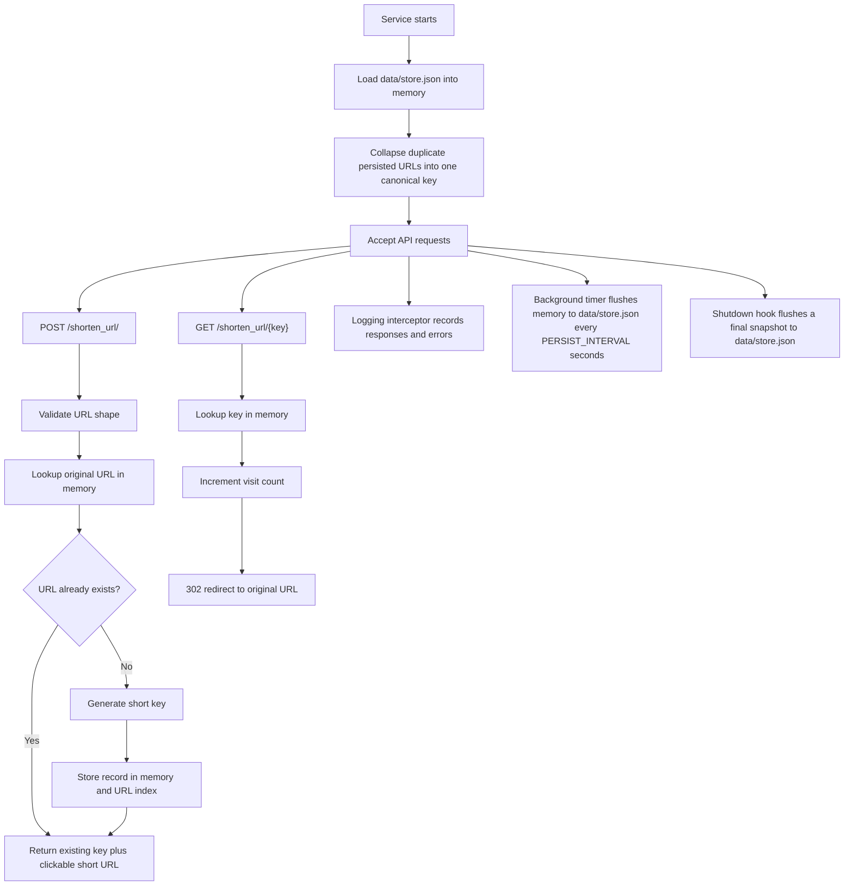

# 1. Overall App Flow

```mermaid
flowchart TD
  A["Service starts"] --> B["Load data/store.json into memory"]
  B --> C["Collapse duplicate persisted URLs into one canonical key"]
  C --> D["Accept API requests"]
  D --> E["POST /shorten_url/"]
  D --> F["GET /shorten_url/{key}"]
  E --> G["Validate URL shape"]
  G --> H["Lookup original URL in memory"]
  H --> I{"URL already exists?"}
  I -->|Yes| J["Return existing key plus clickable short URL"]
  I -->|No| K["Generate short key"]
  K --> L["Store record in memory and URL index"]
  L --> J
  F --> M["Lookup key in memory"]
  M --> N["Increment visit count"]
  N --> O["302 redirect to original URL"]
  D --> P["Logging interceptor records responses and errors"]
  D --> Q["Background timer flushes memory to data/store.json every PERSIST_INTERVAL seconds"]
  D --> R["Shutdown hook flushes a final snapshot to data/store.json"]
```
